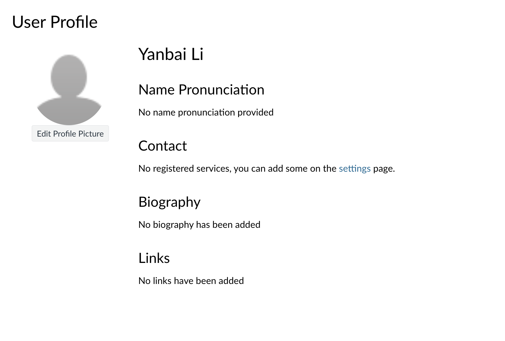

# Yanbai Li

## About Me
Hello! My name is Yanbai Li. I am a Computer Science student who enjoys building projects and learning new technologies.

## Table of Contents
- [Yanbai Li](#yanbai-li)
  - [About Me](#about-me)
  - [Table of Contents](#table-of-contents)
  - [Programming Interests](#programming-interests)
  - [My Goals](#my-goals)
    - [Short-Term Goals](#short-term-goals)
    - [Long-Term Goals](#long-term-goals)
  - [Quote](#quote)
  - [Code Example](#code-example)
  - [Links](#links)
  - [Picture](#picture)

## Programming Interests
I like **Python**, *Java*, and web development.

I also enjoy ~~buggy code~~ solving programming problems.

## My Goals
### Short-Term Goals
1. Improve my programming skills
2. Build more projects
3. Learn software engineering tools

### Long-Term Goals
- Become a strong software engineer
- Work on useful products
- Keep learning new technologies

## Quote
> Programming is not just about writing code. It is also about solving problems and thinking clearly.

## Code Example
Here is a simple Python example:

```python
def greet(name):
    return f"Hello, {name}!"

print(greet("Yanbai"))
```
## Links
Here is an [external link to GitHub](https://github.com/).

Here is a [section link back to About Me](#about-me).

Here is a [relative link to README.md](README.md).

Here is a [relative link to an image file](profile.jpg).

## Picture

